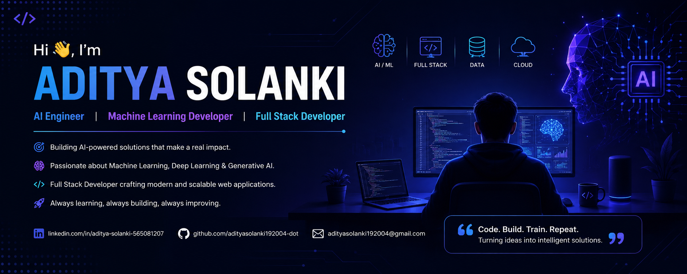

        

## 👨‍💻 About Me

🎓 B.Tech Computer Science Engineering Student

🤖 Artificial Intelligence Engineer

💡 Passionate about AI, Machine Learning, Deep Learning and Full Stack Development

🚀 Building AI-powered applications that solve real-world problems

🌱 Currently Learning

- Generative AI
- LLMs
- LangChain
- RAG
- System Design

📧 Email

adityasolanki192004@gmail.com

## 📈 Contribution Graph

## 🚀 Featured Projects

### 🤖 AI Code Review Assistant

FastAPI + Python + Semgrep

---

### 📄 Smart Resume Analyzer

React + Tailwind + AI

---

### 🛡 SafeRouteAI

Machine Learning + Maps

---

### 🎓 Student Success Analyzer

Machine Learning Prediction

---

### 📱 QR Attendance System

Flask + QR Code

---

### 🍔 Smart Canteen

Flask + MySQL
## 💼 Experience

### Artificial Intelligence Intern

JYESTA Corporate Entity

July 2026 – Present

- Machine Learning
- FastAPI
- Python
- Data Analysis

---

### Data Science Intern

SkillCraft Technology

June 2026

- EDA
- Machine Learning
- Dashboard Development

  ## 📜 Certifications

🏅 Natural Language Processing

🏅 Data Science

🏅 Artificial Intelligence

🏅 Machine Learning

🏅 Python Development

## 💬 Quote

> "The best way to predict the future is to invent it."
> 

## 💬 Quote

> "The best way to predict the future is to invent it."

<!--
**adityasolanki192004-dot/adityasolanki192004-dot** is a ✨ _special_ ✨ repository because its `README.md` (this file) appears on your GitHub profile.

Here are some ideas to get you started:

- 🔭 I’m currently working on ...
- 🌱 I’m currently learning ...
- 👯 I’m looking to collaborate on ...
- 🤔 I’m looking for help with ...
- 💬 Ask me about ...
- 📫 How to reach me: ...
- 😄 Pronouns: ...
- ⚡ Fun fact: ...
-->
